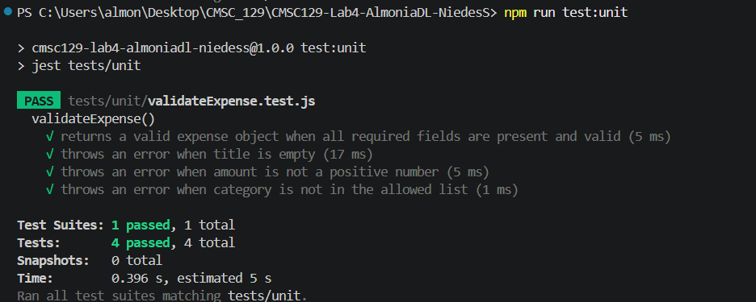
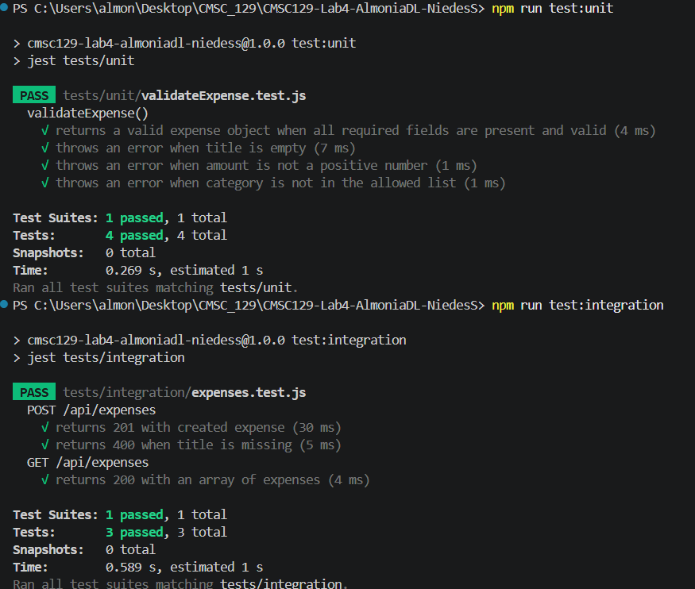
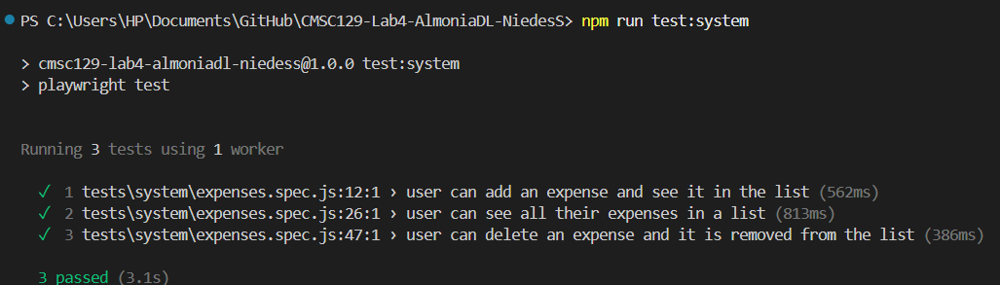
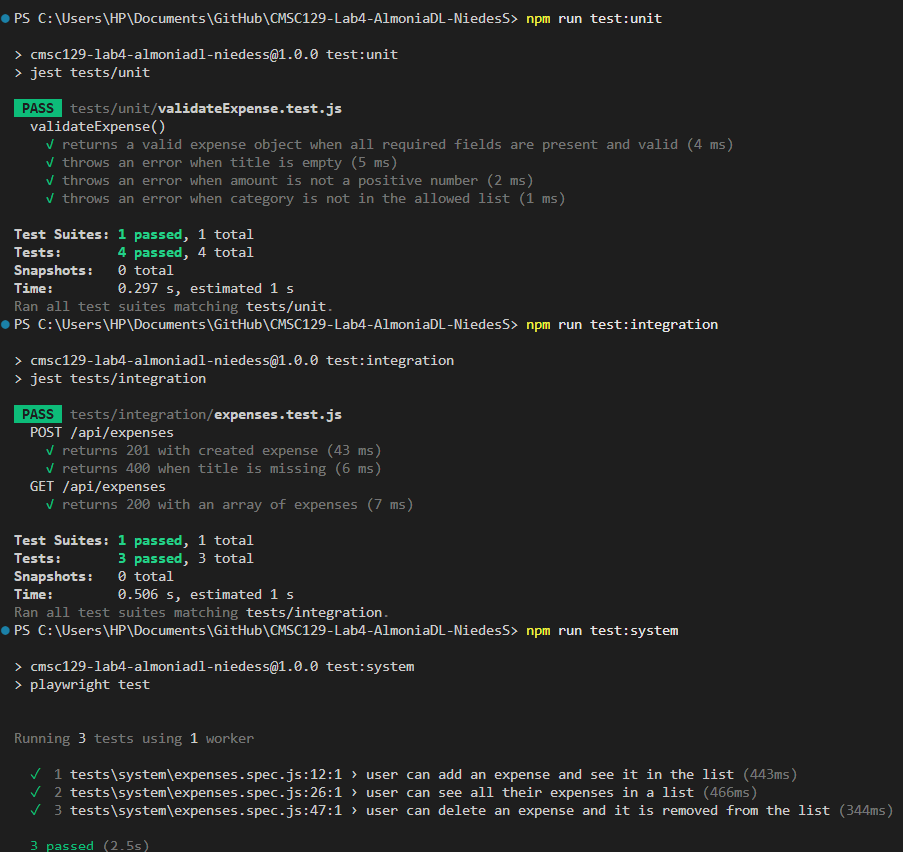

# CMSC129 Lab 4 — Expense Tracker

A single-resource CRUD web application for tracking personal expenses, built using Test-Driven Development (TDD).

## User Stories

1. **Add expense** — As a user, I want to add an expense with a title, amount, and category, so that I can log my spending.
2. **View expenses** — As a user, I want to see all my expenses in a list, so that I can review where my money goes.
3. **Delete expense** — As a user, I want to remove an expense, so that I can clean up entries I no longer need.

## Tech Stack

| Layer | Tool |
|-------|------|
| Frontend | React + Vite |
| Backend | Express (in-memory storage) |
| Unit tests | Jest + React Testing Library |
| Integration tests | Jest + Supertest |
| System tests | Playwright |
| CI/CD | GitHub Actions |
| Deployment | Render (API) + Vercel (frontend) |

## Testing Strategy

### Unit Tests
Target: `validateExpense()` in `server/src/validation/validateExpense.js`
What: Pure validation logic in isolation — title non-empty, amount positive, category in allowed list. No HTTP, no browser, no database.

### Integration Tests
Target: Express route handlers + expense store working together through real HTTP requests.
What: Full request-response cycles — POST creates a record, GET returns all records, DELETE removes a record, validation errors return proper status codes.

### System Tests
Target: Complete user journeys through a real browser using Playwright.
What: One test per user story — submitting the add expense form, viewing the list, clicking delete. Tests assert UI elements and behavior match user expectations.

## Setup Instructions

### Prerequisites
- Node.js 18+
- npm

### Clone and Install
```bash
git clone <repo-url>
cd CMSC129-Lab4-AlmoniaDL-NiedesS
npm install
npx playwright install chromium
```

### Run the App
```bash
npm run dev
```
- Frontend: http://localhost:3000
- Backend: http://localhost:3001

### Run Tests
```bash
npm run test:unit       # Unit tests only
npm run test:integration # Integration tests only
npm run test:system     # System tests only
npm test                # All tests
```

## CI/CD Pipeline

GitHub Actions runs all tests on every push to `main`. Red-phase commits must show a failing pipeline; Green-phase commits must show a passing pipeline. Deployment proceeds only when all tests pass.

## Test Results

### Unit Test


### Integration Test


### System Test


### All Tests


## Reflection

The most challenging part of writing tests before code was visualizing the complete system before any features existed. Without a working implementation, it was difficult to determine exactly what to test and at what level of detail. For example, defining unit tests for `validateExpense()` required predicting exactly what edge cases the validation should handle — empty titles, negative amounts, invalid categories — before writing a single line of validation logic. Similarly, writing Playwright tests for the system layer meant imagining DOM structure and data-testid attributes for components that didn't yet exist. This forced us to think carefully upfront about how users would interact with the final application rather than coding first and testing later.

Writing tests first fundamentally changed how we designed the code. It forced modularization at every level. Unit tests required pure, isolated validation functions separate from Express route handlers. Integration tests required clean HTTP abstractions where routes delegate to controllers and controllers delegate to the store. System tests required well-defined component interfaces and consistent `data-testid` attributes across the UI. Without TDD, our natural instinct would have been to write everything inline and refactor later. Writing tests first made modularity a prerequisite rather than an afterthought, resulting in a codebase where each layer has a single responsibility and each piece can be tested independently.